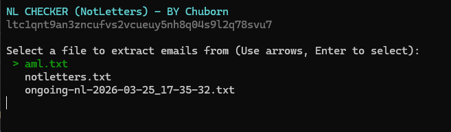
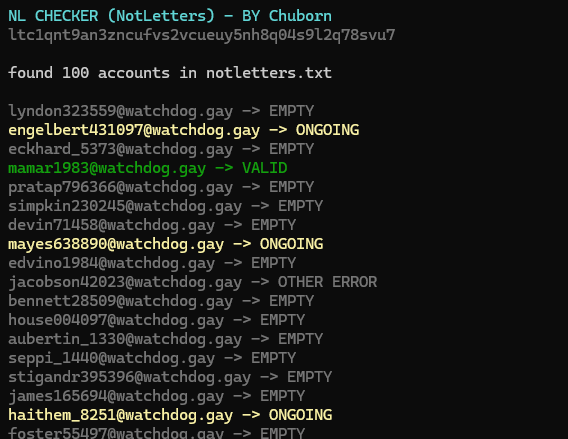

NL-AML Checker

- Fully request-based
- Works with any notletters-based aml
- Proxyless and multithreaded

Features
- Ready to secure AMLs
- Canceled AMLs
- Ongoing AMLs
- MS canceled AMLs

How to use it
- nl.py
- a .txt contains amls from tzi (no need to extract the mails)(selected with a arrow key)

Results 
- Saves all the mails in plaintext
- Classifies the amls by status
- Saves ongoing aml to the root folder to be used again next time you check

TBD
- Improve MS canceled AMLs detection
- Add proxy support

Donations if this saved you time -> ltc1qnt9an3zncufvs2vcueuy5nh8q04s9l2q78svu7
